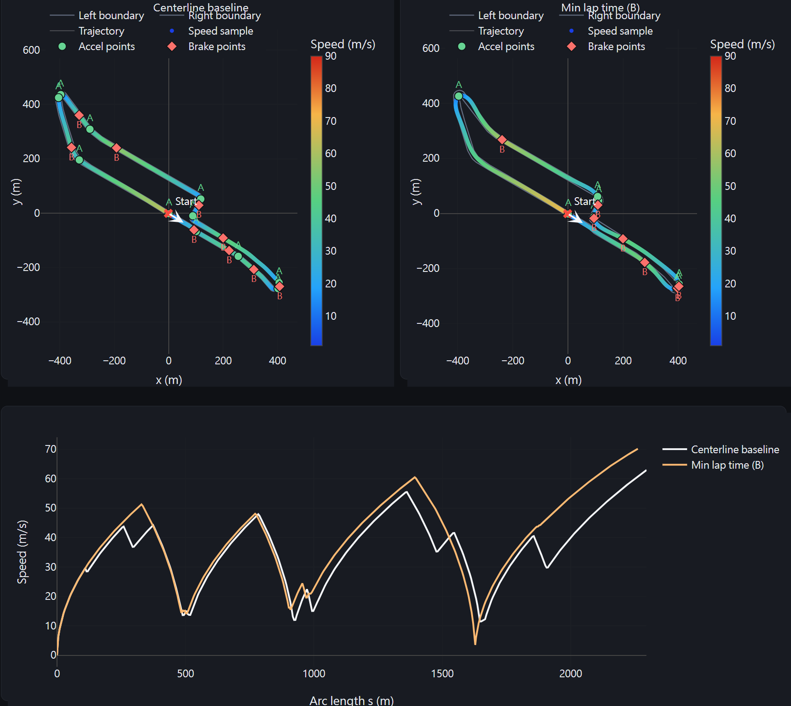

# TrackOpt Dashboard

Local racing-line analysis and visualization project for comparing baseline and optimized trajectories across a shared track dataset.

The project combines numerical track analysis, vehicle-constrained speed profiling, and a local web dashboard for comparing four trajectory-generation methods:

1. `centerline_baseline`
2. `min_curvature` (A)
3. `min_lap_time` (B)
4. `min_curvature_custom` (C)

The current workflow is built around cached, plot-ready results. You can precompute the full track-method matrix once, reuse it across launches, and selectively refresh vehicle-dependent metrics when only the vehicle configuration changes.



## What the Project Does

- Loads closed-circuit track centerlines and widths from the dataset in `data/tracks/`.
- Computes curvature, speed profiles, lap-time integrations, and track difficulty metrics.
- Runs path optimization experiments for multiple racing-line methods.
- Exposes a local FastAPI + Plotly dashboard for overview ranking and track-by-track comparison.
- Persists web-ready payloads under `outputs/web_cache/` so the browser does not recompute each method on every selection.

## Repository Highlights

- `source/`: numerical methods, CLI, speed-profile logic, geometry, plots, and configuration loading.
- `webapp/`: backend service and API that feed the local dashboard.
- `frontend/`: static dashboard pages and Plotly-based comparison views.
- `script/run_webapp.py`: preloading launcher for the local dashboard.
- `script/track_cli.py`: Typer CLI for audits, studies, and path optimization runs.
- `config/vehicle.json`: grouped runtime configuration with `vehicle` and `optimization` sections.

## Quick Start

### 1. Install `uv`

If `uv` is not already installed:

```bash
python -m pip install uv
```

### 2. Install project dependencies

From the repository root:

```bash
uv sync
```

This creates the local environment and installs the dependencies declared in `pyproject.toml`.

### 3. Launch the dashboard

```bash
uv run script/run_webapp.py
```

Then open `http://127.0.0.1:8000` in your browser.

On the first run, the launcher will build cached web results if no valid cache is available. Later launches reuse the persisted cache when possible.

## Basic Commands

### Web dashboard

Start the dashboard and reuse any valid cache:

```bash
uv run script/run_webapp.py
```

Force a full recomputation of all trajectory methods and cached results:

```bash
uv run script/run_webapp.py --rerun-all
```

Reuse cached optimized paths but refresh vehicle-dependent speed profiles and metrics:

```bash
uv run script/run_webapp.py --rerun-vehicle
```

### CLI examples

List all available tracks:

```bash
uv run script/track_cli.py list-tracks
```

Run the centerline speed-profile analysis for one track:

```bash
uv run script/track_cli.py analyze-track --track BrandsHatch
```

Run the teammate path optimization flow for one track:

```bash
uv run script/track_cli.py optimize-path --track BrandsHatch
```

Audit a track dataset and save the generated figures:

```bash
uv run script/track_cli.py audit-track --track BrandsHatch
```

Show the full CLI help:

```bash
uv run script/track_cli.py --help
```

## Dashboard Workflow

The web UI supports two main workflows:

1. Overview mode for ranking tracks by difficulty and comparing method-to-method rank changes.
2. Track-detail mode for inspecting one track with either a single method or compare mode.

In compare mode, the dashboard supports:

- side-by-side left/right map views,
- overlay trajectory views with per-method transparency control,
- synchronized zoom and pan across the side-by-side maps, and
- shared speed-color comparisons across methods.

## Configuration

Runtime settings live in `config/vehicle.json` and are grouped into two sections:

- `vehicle`: friction, longitudinal limits, power, and speed bounds.
- `optimization`: solver and optimization parameters for methods A, B, and C.

This split matters for cache reuse:

- changing `vehicle` settings can use `--rerun-vehicle`, because the optimized paths remain valid,
- changing `optimization` settings should use `--rerun-all`, because the optimized trajectories themselves may change.

## Outputs

- `outputs/figures/`: saved plots from the CLI workflows.
- `outputs/web_cache/`: persisted dashboard payloads and cache metadata.
